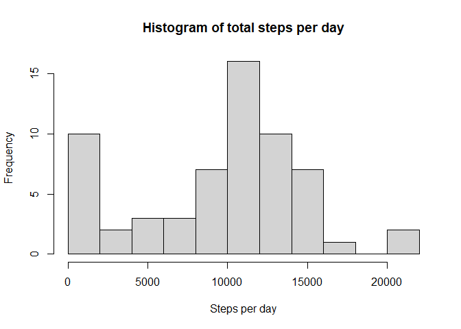
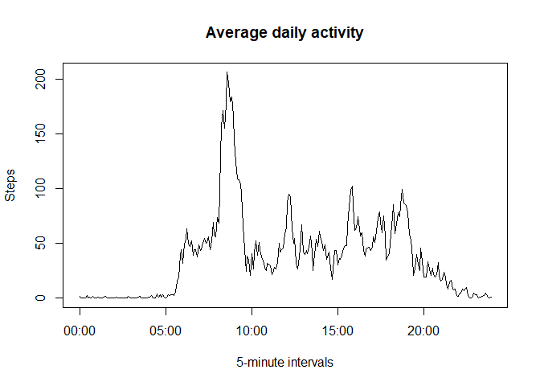
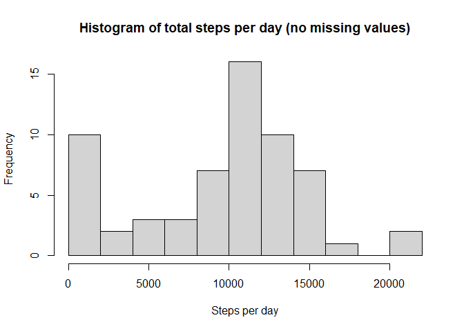

## Loading and preprocessing the data
Load data

```r
activity <- read.csv(unz("activity.zip","activity.csv"))
```

Convert dates into date format

```r
activity$date <- as.Date(activity$date, "%Y-%m-%d")
```

Format intervals as time

```r
library(stringr)
activity$interval <- format(strptime(str_pad(activity$interval, 4, pad="0"), format="%H%M"), format="%H:%M")
```

## What is mean total number of steps taken per day?

Calculate the total number of sterps taken per day

```r
library(dplyr)
SPD <- activity %>% group_by(date) %>% summarise(steps = sum(steps, na.rm=TRUE))
```

Plot a total number of steps per day in a histogram

```r
hist(SPD$steps, breaks=10, main="Histogram of total steps per day", xlab="Steps per day")
```

<!-- -->

Calculate average number of steps

```r
mean_steps <- mean(SPD$steps)
median_steps <- median(SPD$steps)
```
Mean of total number of steps is 9354.2295082.  
Median of total number of steps is 10395.

## What is the average daily activity pattern?

Calculate average number of steps per each 5-minute interval

```r
SPI <- activity %>% group_by(interval) %>% summarise(steps = mean(steps, na.rm=TRUE))
```

Plot the average daily activity pattern

```r
plot(x=strptime(SPI$interval,"%H:%M"), y=SPI$steps, type="l", main="Average daily activity", ylab="Steps", xlab="5-minute intervals")
```

<!-- -->


```r
interval_max <- SPI[SPI$steps == max(SPI$steps), "interval"]$interval
```
The most active 5-minute interval (on average) is 08:35.

## Imputing missing values

Number of missing values in each column of activity

```r
sapply(activity, function(x) sum(is.na(x)))
```

```
##    steps     date interval 
##     2304        0        0
```

Inpute missing values with a median values for the interval. For example, if number of steps is missing for a certain date interval 08:00, every day 08:00 interval median value of steps is taken.

```r
activity1 <- activity %>% group_by(interval) %>% mutate(steps=ifelse(is.na(steps), median(steps,na.rm=TRUE), steps))
```

Plot a total number of steps per day in a histogram

```r
SPD1 <- activity1 %>% group_by(date) %>% summarise(steps = sum(steps))
hist(SPD1$steps, breaks=10, main="Histogram of total steps per day (no missing values)", xlab ="Steps per day")
```

<!-- -->

Calculate average number of steps

```r
mean_steps <- mean(SPD1$steps)
median_steps <- median(SPD1$steps)
```
Mean of total number of steps is 9503.8688525.  
Median of total number of steps is 10395.

Shape of the histogram haven't significantly changed.  
Median value is the same as median was used to impute missing values. 
Mean of total number of steps slighly increased after imputing missing values.  

## Are there differences in activity patterns between weekdays and weekends?

Create a factor variable for weekday/weekend

```r
activity1$day <- factor(ifelse(weekdays(activity1$date) == "Saturday" | weekdays(activity1$date) == "Sunday", "weekend", "weekday"))
```

Plot average activity patterns for weekdays and weekend

```r
SPI1 <- activity1 %>% group_by(day, interval) %>% summarise(steps=mean(steps))
SPI1$interval <- as.numeric(sub(":", "" ,SPI1$interval))
library(lattice)
xyplot(steps ~ interval | day, data=SPI1, type="l", layout=c(1,2))
```

<!-- -->
